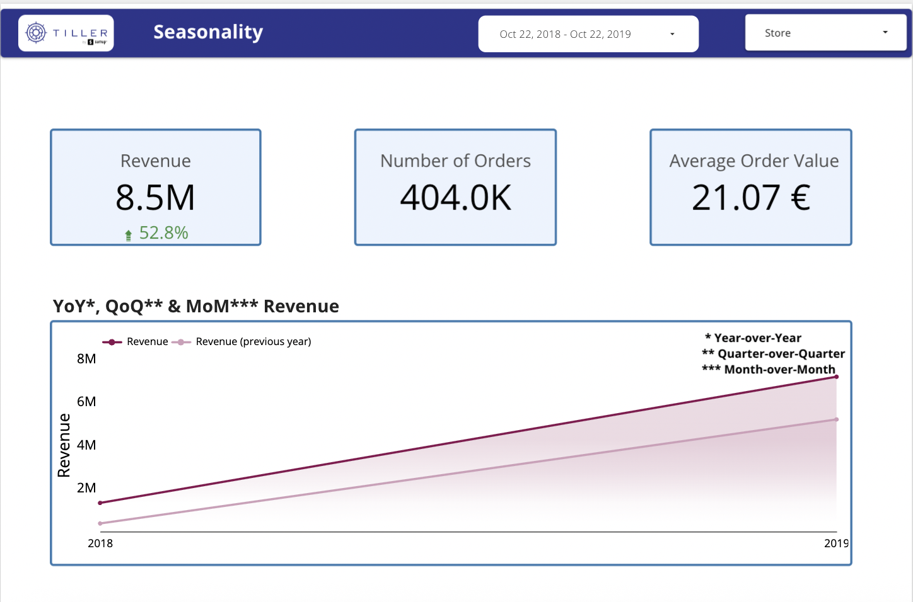
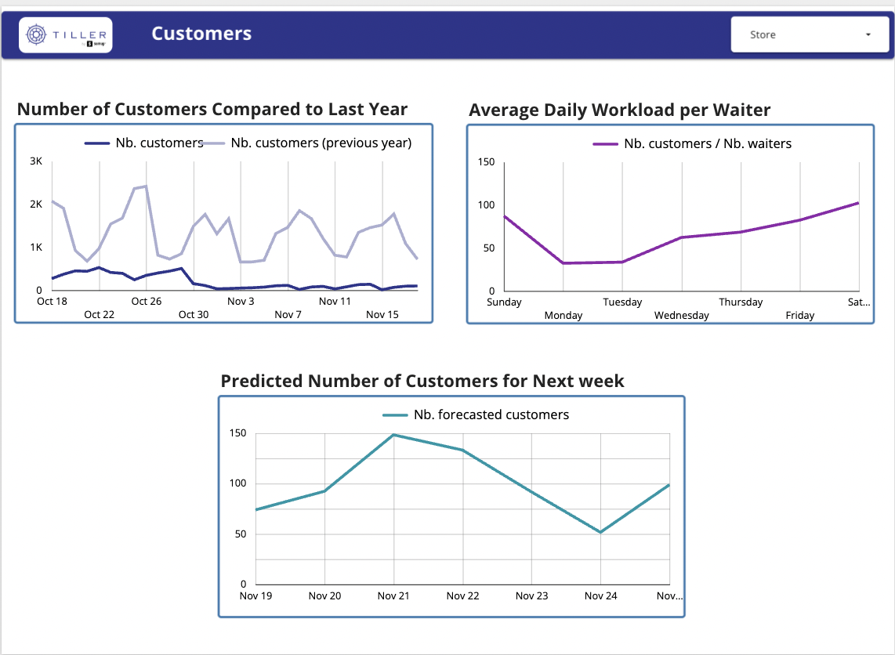
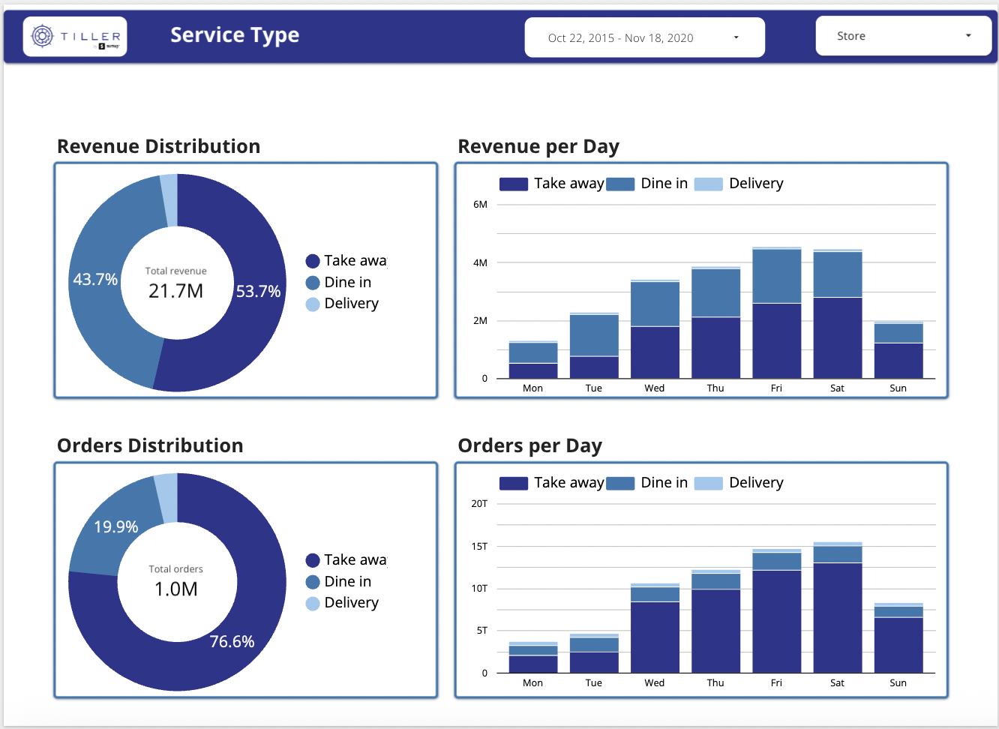
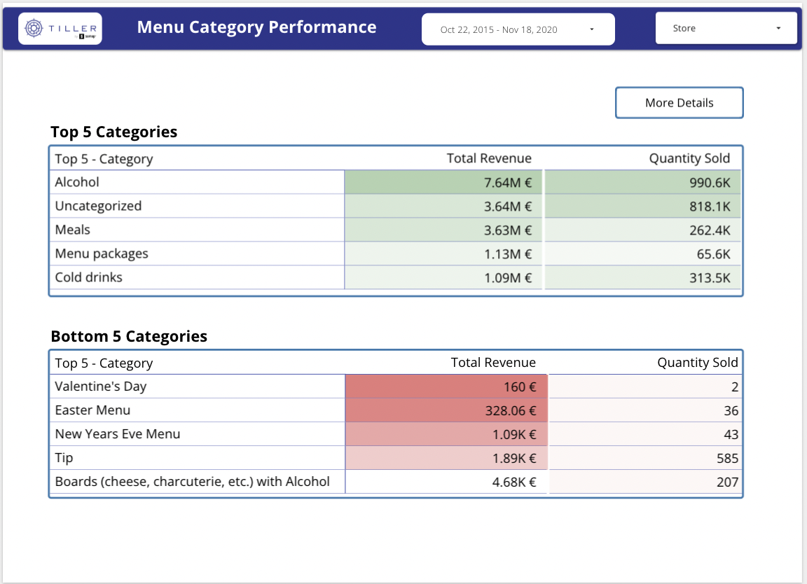

# 📊 Tiller by SumUp — MVP Restaurant Dashboard

## 🔹 Problem Statement
Restaurants operate in a fast-paced, competitive environment with thin margins. While they generate large volumes of raw operational and transactional data, they rarely leverage analytics to optimize performance, staffing, or revenue.  

The goal of this project was to analyze **Tiller by SumUp data** and deliver a **Minimum Viable Product (MVP)** — an interactive dashboard prototype enabling restaurant owners to **visualize, understand, and interact with their data** to support smarter, data-driven business decisions.

---

## 🔹 Methodology
1. **Data Acquisition & Cleaning**  
   - Imported raw Tiller dataset into **Google BigQuery**.  
   - Performed extensive **data cleaning and transformation** directly in BigQuery, including:  
     - Handling missing values  
     - Correcting data types  
     - Removing duplicates  
     - Standardizing formats  
   - **Joined multiple tables** (orders, order lines, store data) to create a cohesive dataset ready for analysis.  
   - Performed additional transformations in **Google Sheets** to refine menu categories:
     - Reduced 410 unique free-text entries into 30 standardized categories across 21 clients for consistent analysis. 
     - 📑 Source: [Tiller_Order_Line_Categories](https://docs.google.com/spreadsheets/d/15_J4CYN65zrXH_wnfmNabcuE18KIbrpEReLaBSnFrKM/edit?usp=sharing)
   - Built a new BigQuery table for cross-sell analysis (co-occurrence analysis of categories per store).
     - 📑 Source: [Category Co-occurence per Store](https://docs.google.com/spreadsheets/d/1Y6oKKEPObcDCUJI9FXeTibOZrgUOgLLMlZmTAXuNpqU/edit?usp=sharing)
     - [View SQL Queries](SQL_cleaning_transformations_Idil_Dorak) for full SQL query documentation by Idil Dorak.

2. **Exploratory Data Analysis (EDA)**  
   - Analyzed seasonality, peak hours, revenue trends, customer attendance, and staff workload.  
   - Examined menu performance and identified top-selling items and combinations.

3. **Dashboard Development**  
   - Built interactive dashboards in **Looker Studio**.  
   - Added drill-downs and filters by store, service type, time period, day type, and menu category.  
   - Designed visualizations for KPIs and operational metrics to guide actionable decisions.  

4. **Business Insights & Recommendations**  
   - Provided insights on seasonal trends, staffing optimization, and menu performance.  
   - Suggested data-driven operational improvements and strategic decisions.
   - Recommended using dropdown menus with predefined categories to avoid free-text inconsistencies in staff data entry.

---

## 🔹 Key Business Questions
- How do orders and revenue vary across time and season?  
- Which menu items generate the most revenue, and which underperform?  
- How is staff workload distributed across waiters and service types?  
- How can restaurant operations and marketing decisions be improved using data?  

---

## 🔹 Final Insights & Recommendations
1. **Seasonality & Revenue Patterns**:  
   - Identified peak hours and high-performing events.  

2. **Customer Attendance & Staffing**:  
   - Forecasted weekly attendance and workload to optimize staff allocation.  

3. **Service Type Analysis**:  
   - Patterns for dine-in, take-away, and delivery services inform operational strategy.  

4. **Menu Category Performance** *(my personal focus)*:  
   - Highlighted best- and worst-performing items; identified opportunities for upselling and menu optimization.
   - Found that **“Uncategorized” was among the top-performing groups**, underlining the need for standardized data entry.

---

## 🔹 Dashboard Preview

Here are some snapshots of the MVP Tiller Dashboard:

   
 

### 📌 **Explore the live dashboard:** [Tiller Restaurant Dashboard](https://lookerstudio.google.com/reporting/46e3234e-0289-4347-8875-0275309b1e6f)

---

## 🔹 Tools & Technologies
- **Google BigQuery** (raw data cleaning, transformations, analysis)  
- **Google Sheets** (additional data cleaning and preparation)  
- **Python** (forecasting, analytics, ML)  
- **Looker Studio** (interactive dashboards & visualization)  

---

## 🔹 Dataset
- Source: **Tiller by SumUp** (Paris restaurants, 2015–2020)  
- Over 1.2M orders across 21 restaurants, including service, menu, staff, and operational data.  

---

## 🔹 How to Explore
:bar_chart: Interact with the **live dashboard** here: [🔗 Tiller Dashboard](https://lookerstudio.google.com/reporting/46e3234e-0289-4347-8875-0275309b1e6f)  
🏠: Explore the main collaborative repository here: [🔗 The Main Repository](https://github.com/sdelgiu/MVP-Tiller-by-SumUp)

---

## 🔹 Personal Contribution
👩‍💻 *This project was developed collaboratively during a Data Analytics Bootcamp at Le Wagon. My contribution focused on **cleaning and transforming raw order_line data in BigQuery and Google Sheets, as well as building dashboards and generating insights on menu category performance**, while teammates explored other business areas such as sales and service analysis.*

---
## 🔹 Team
- Simone Del Giudice – ✉️ sim.delgiu@gmail.com
- Idil Dorak – ✉️ idildorak@gmail.com
- Alba Castillo – ✉️ albacastillo90@gmail.com
- Sebastião Mesquita – ✉️ sebastiaokmesquita@msn.com
